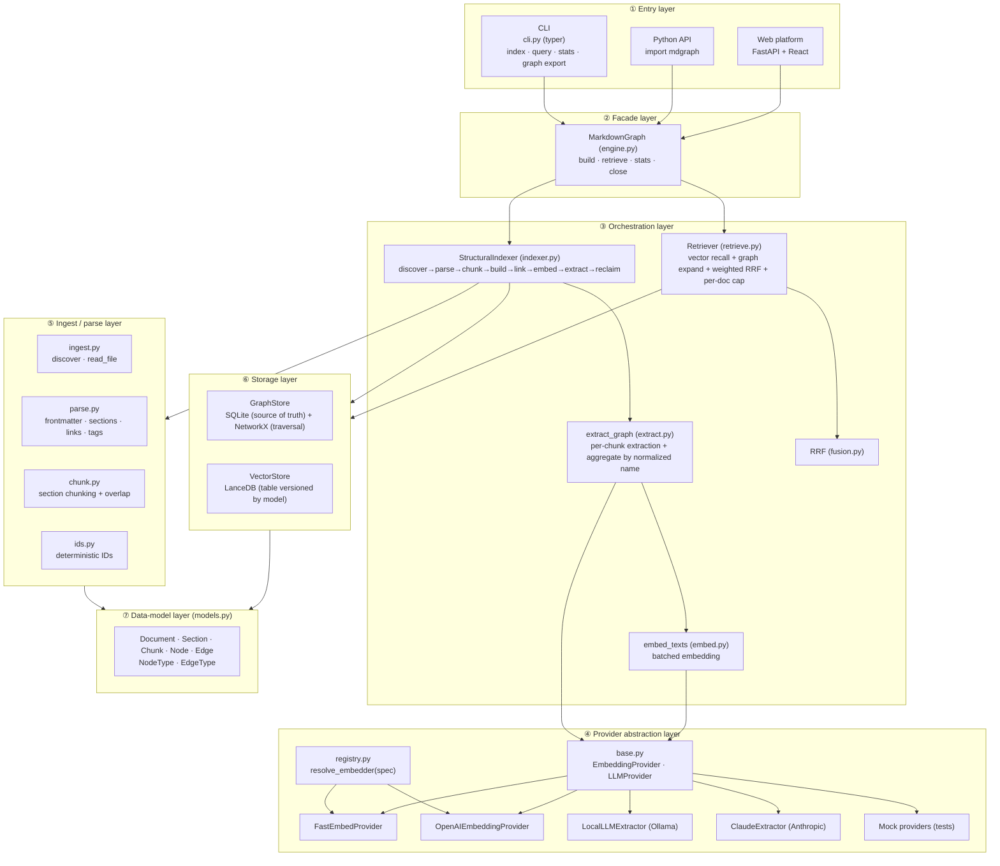
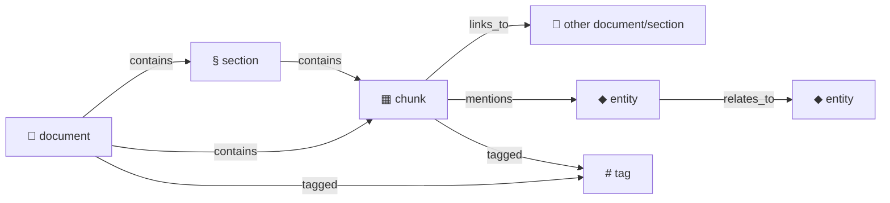
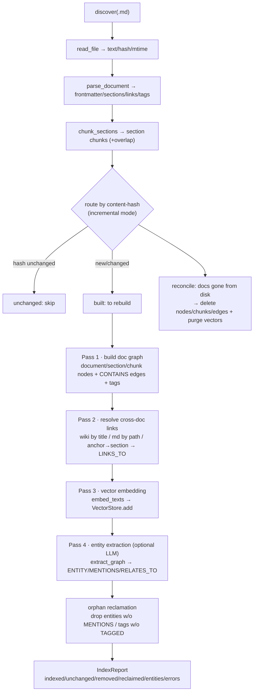
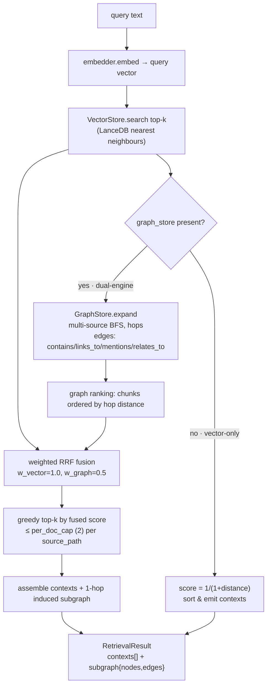
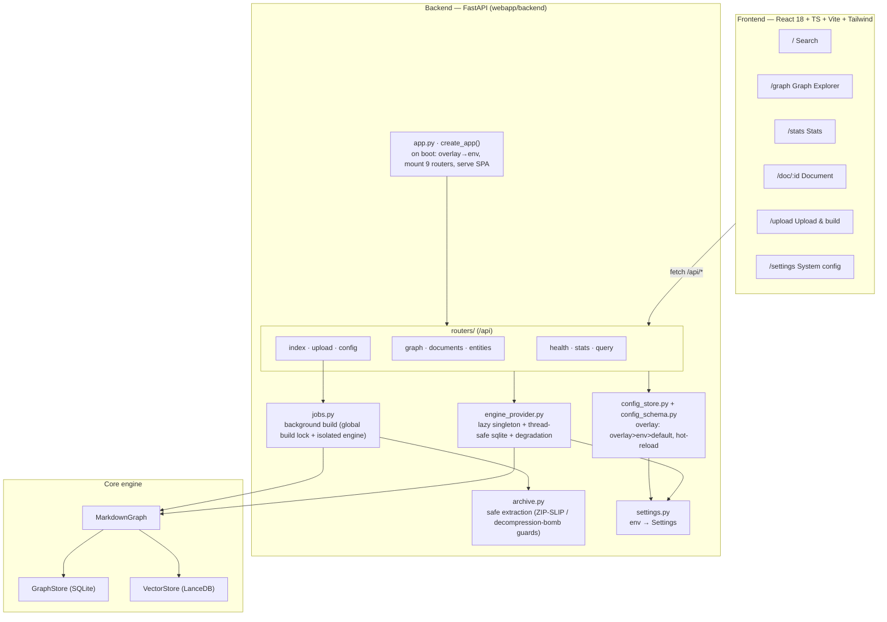
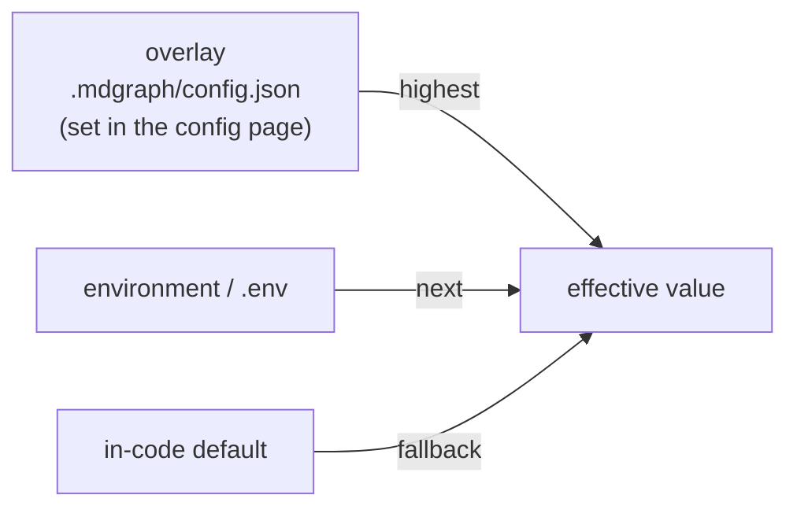

# markdown-graph (mdgraph)

<p align="center">
  <a href="https://github.com/Jouryjc/markdown-graph/actions/workflows/ci.yml"></a>
  <a href="LICENSE"></a>
  
  <a href="https://github.com/astral-sh/ruff"></a>
  <a href="CONTRIBUTING.md"></a>
</p>

<p align="center">
  
  
  
  
  
</p>

<p align="center"><b>English</b> | <a href="README.zh-CN.md">简体中文</a></p>

> Markdown knowledge graph + vector dual-engine retrieval — index a pile of `.md`
> docs into **both** a structural/semantic **graph** and a **vector store**, then
> let the two recall paths reinforce each other at query time
> (vector recall × graph expand × weighted RRF fusion).

The entire core pipeline is **offline, deterministic, and zero-credential** by
default (local fastembed vectors + local Ollama entity extraction) — unit-testable
and reproducible. It also ships a command-line interface (CLI) and a full
FastAPI + React web platform.

---

## Table of contents

- [Highlights](#highlights)
- [System architecture](#system-architecture)
- [Knowledge-graph data model](#knowledge-graph-data-model)
- [Indexing pipeline](#indexing-pipeline)
- [Retrieval pipeline](#retrieval-pipeline)
- [Module-by-layer reference](#module-by-layer-reference)
- [Web platform architecture](#web-platform-architecture)
- [Configuration](#configuration)
- [Quick start](#quick-start)
- [Project layout](#project-layout)
- [Tests](#tests)

---

## Highlights

| Capability | What it does |
| --- | --- |
| **Structural graph** | Parses markdown heading hierarchy, `[[wiki]]` / `[md](link)` links, `#tag`, and frontmatter into a `document → section → chunk` containment tree plus cross-document links. |
| **Semantic graph** | Optionally calls an LLM to extract entities (concept / tech / product / org) and directed relations from each chunk, building `MENTIONS` / `RELATES_TO` edges. |
| **Vector retrieval** | LanceDB embedded vector store; the table name is versioned by `embedder.name + dim`, so switching models is automatically isolated. |
| **Dual-engine fusion** | Vector recall + graph expansion (BFS) as two rankings, fused via weighted RRF (graph weight < vector weight to dampen hub over-amplification), with per-document capping. |
| **Incremental indexing** | Content-hash routing: unchanged skipped, changed rebuilt, vanished reclaimed (including orphan entity / tag reclamation). |
| **Pluggable providers** | Embedder / LLM behind abstract interfaces + a registry; resolved by short name (`fastembed:` / `openai:`) or dotted path. The engine binds to no concrete implementation. |
| **Three entry points** | Python facade `MarkdownGraph`, CLI `mdgraph`, and the web platform (upload-to-build + visual retrieval + in-browser config). |

---

## System architecture

Seven layers, bottom-up; each layer depends only on the abstraction below it. All
three entry points (CLI / Python / Web) converge on the same `MarkdownGraph` facade.



---

## Knowledge-graph data model

The graph is a **heterogeneous directed multigraph**. SQLite is the source of
truth; NetworkX is rebuilt on demand for traversal. Every ID is generated
deterministically by `ids.py` (first 16 hex of `sha256`) for idempotency and
reproducibility.

**Node types (`NodeType`)**

| Type | Source | Key meta |
| --- | --- | --- |
| `document` | each `.md` file | `path` |
| `section` | a heading-derived section | `heading_path`, `level` |
| `chunk` | section chunk (smallest retrieval unit) | `section_path`, `unresolved_links` |
| `entity` | LLM-extracted entity | `name`, `type`, `description`, `aliases` |
| `tag` | frontmatter / `#tag` | `name` |

**Edge types (`EdgeType`)**

| Type | Meaning | Endpoints |
| --- | --- | --- |
| `contains` | structural containment | document→section→chunk |
| `links_to` | cross-doc / anchor link | chunk → document/section |
| `tagged` | tagging | document/chunk → tag |
| `mentions` | chunk mentions an entity | chunk → entity |
| `relates_to` | directed entity relation (`meta.type` holds the relation name) | entity → entity |



---

## Indexing pipeline

`StructuralIndexer.index()` is the heart of the write path. It runs in multiple
passes and reports progress through an optional `progress(phase, current, total)`
callback (used by the web upload flow to drive a live progress bar).



Key points:

- **Incremental**: a content-hash hit means skip; only `built` (new/changed) docs
  are rebuilt, embedded, and extracted.
- **Consistency**: each document's graph writes run inside one SQLite transaction
  (`commit=False` + a single commit on exit, rollback on error); vector deletes are
  deliberately outside the transaction (vectors are a derived index re-synced on the
  next build).
- **Resilient**: a per-document parse/build error is collected into `report.errors`
  and skipped without affecting other docs; errored docs are excluded from
  embedding/extraction.
- **No ghosts**: a `relates_to` edge is kept only when both endpoint entities appear
  in the same extraction; entities are aggregated across chunks by `entity_id`
  (normalized name), merging `aliases`.

---

## Retrieval pipeline

`Retriever.retrieve()` supports two modes: vector-only (no graph store) and
dual-engine (default). Dual-engine uses graph expansion to widen recall and
weighted RRF to fuse the rankings.



Key points:

- **Graph expansion widens recall**: vector top-k act as seeds; expanding `hops`
  along the graph pulls in chunks that are semantically/structurally adjacent but
  missed by vector search.
- **Weighted RRF**: `score = Σ wᵢ × 1/(k + rank)`; the graph weight is below the
  vector weight to dampen hub nodes being over-amplified by expansion.
- **Per-document capping**: while greedily selecting top-k, each source document
  contributes at most `per_doc_cap` chunks, preventing a single doc from flooding.
- **Explainable**: the result includes the 1-hop induced subgraph of the hits, which
  the frontend renders directly.

---

## Module-by-layer reference

### Core engine `src/mdgraph/`

| Module | Responsibility |
| --- | --- |
| `engine.py` | Facade `MarkdownGraph`: composes store + indexer + retriever; exposes `build/retrieve/stats/close`. |
| `indexer.py` | `StructuralIndexer`: write-path orchestration (see [indexing pipeline](#indexing-pipeline)). |
| `retrieve.py` | `Retriever` + `Context` / `RetrievalResult`: read-path orchestration (see [retrieval pipeline](#retrieval-pipeline)). |
| `models.py` | Pydantic data models + `NodeType` / `EdgeType` enums. |
| `ingest.py` | `discover` (recursively collect `.md`, dedup + sort), `read_file` (text/hash/mtime). |
| `parse.py` | `parse_document`: frontmatter (YAML), heading-hierarchy sections, `[[wiki]]` / `[md]()` links, `#tag`; code-fence aware (won't mis-extract links/tags inside code). |
| `chunk.py` | `chunk_sections`: a section is a chunk; split by paragraph + `overlap` only when it exceeds `max_chars`. |
| `ids.py` | Deterministic IDs: `doc_id` / `section_id` / `chunk_id` / `entity_id` (normalized name) / `tag_id`. |
| `extract.py` | `extract_graph`: per-chunk LLM calls, aggregate by `entity_id`, dedup mentions/relations, drop ghost relations. |
| `embed.py` | `embed_texts`: batch calls to the embedder up to a batch cap. |
| `fusion.py` | `reciprocal_rank_fusion`: weighted RRF. |
| `store/graph_store.py` | `GraphStore`: SQLite (documents/nodes/edges/chunks tables) as source of truth, NetworkX `MultiDiGraph` for `neighbors`/`expand`/`subgraph`; transaction context, `reclaim_orphans`, `export_graph`. |
| `store/vector_store.py` | `VectorStore`: LanceDB, table `vectors_<sanitized name>_<dim>`, versioned by model + dim. |
| `cli.py` | typer CLI: `index` / `query` / `stats` / `graph export`. |

### Provider layer `src/mdgraph/providers/`

| Module | Responsibility |
| --- | --- |
| `base.py` | Abstract interfaces `EmbeddingProvider` (`name`/`dim`/`embed`), `LLMProvider` (`extract`) + extraction-result dataclasses. |
| `registry.py` | `resolve_embedder(spec)`: short names `fastembed:` / `openai:` go through factories, otherwise treated as a dotted path constructed with no args; failures raise `ValueError` carrying the original spec. |
| `fastembed_embedder.py` | Local fastembed vectors (default `BAAI/bge-small-zh-v1.5`, no key). |
| `openai_embedder.py` | OpenAI-compatible embedding endpoint (defaults to local Ollama; switchable to cloud). |
| `local_llm_extractor.py` | Local LLM entity extraction (openai SDK → local OpenAI-compatible endpoint, default Ollama); defensive parsing of malformed JSON and multiple relation shapes. |
| `anthropic_extractor.py` | Anthropic Claude with tool-use forced structured extraction. |
| `mock.py` | Deterministic Mock embedder / LLM for offline tests. |

---

## Web platform architecture

`webapp/` is an application layer on top of the core engine: a **FastAPI backend**
(nine `/api` routes) + a **React/Vite SPA frontend**. The backend reuses
`MarkdownGraph` through a **lazy singleton engine**, adding thread-safety, graceful
degradation, background builds, and hot-reloading config on top.



### API routes (prefix `/api`)

| Method + path | Purpose |
| --- | --- |
| `GET /health` | Health check |
| `GET /stats` | Graph / vector size stats |
| `POST /query` | Dual-engine / vector-only retrieval (`mode`, `k`, `graph_weight`, `per_doc_cap`, `hops`) |
| `GET /graph` · `GET /graph/expand` | Full graph (truncatable) / subgraph expansion |
| `GET /documents` · `GET /document/{id}` · `GET /node/{id}` | Document list / detail / node neighbours |
| `GET /entities` | Entity list (by mention count) |
| `POST /index` | Index a server-local path |
| `POST /upload` · `GET /jobs/{id}` | Async upload-archive build (202) + poll job progress |
| `GET /config` · `PUT /config` · `POST /config/reset` | Read / update / reset the visual system config |

### Three key designs

- **Singleton engine + graceful degradation** (`engine_provider.py`): graph/store
  reads are always available; if the embedder deps are missing or the store has no
  vectors, `query`/`index` raise `EngineUnavailable` → HTTP 503, while everything
  else keeps working. FastAPI runs sync endpoints in a threadpool, so after
  construction the SQLite connection is swapped to `check_same_thread=False`;
  reconfiguration uses "swap-reference + defer GC" so a connection is never closed
  out from under an in-flight reader.
- **Background builds** (`jobs.py` + `archive.py`): uploads go through 202 + job
  polling; a global build lock guarantees at most one build at a time (busy → 409);
  an **isolated engine** (its own sqlite connection + fresh providers) does the build
  and calls `reset_engine()` on success so the serving singleton reopens against the
  new data; `archive.py` guards against ZIP-SLIP / path traversal / decompression
  bombs and only writes `.md` / `.markdown`.
- **Hot-reloading config** (`config_schema.py` + `config_store.py`):
  `config_schema.py` is the **single source of truth for every configurable
  environment variable** (`FieldSpec`); the overlay precedence is
  `overlay > env > default`, persisted to `REPO_ROOT/.mdgraph/config.json`; saving
  writes into `os.environ` and calls `reset_engine()` so the next
  `get_settings()`/`get_engine()` picks up the new values.

---

## Configuration

Every setting ultimately surfaces as a process environment variable, with a
three-tier precedence:



Main environment variables (full list in `webapp/backend/config_schema.py`):

| Variable | Default | Meaning |
| --- | --- | --- |
| `MDGRAPH_STORE` | `./.mdgraph` | Graph + vector store dir (resolved against repo root). |
| `MDGRAPH_EMBEDDER` | `mdgraph.providers.fastembed_embedder:FastEmbedProvider` | embedder spec: `fastembed:<model>` / `openai:<model>` / dotted path. |
| `MDGRAPH_LLM` | (empty = disabled) | dotted path of the entity-extraction provider. |
| `MDGRAPH_EMBED_BASE_URL` / `_API_KEY` / `_MODEL` | local Ollama | OpenAI-compatible embedding endpoint config (secret never enters the spec / shell history). |
| `MDGRAPH_LLM_BASE_URL` / `_API_KEY` / `_MODEL` | local Ollama / `qwen2.5:3b` | local LLM extraction endpoint config. |
| `ANTHROPIC_API_KEY` / `_AUTH_TOKEN` / `_BASE_URL` / `_MODEL` | — | credentials + endpoint when using Claude for the entity layer. |
| `MDGRAPH_MAX_ARCHIVE_BYTES`, … | see schema | upload / extraction safety limits. |

> ⚠️ **Changing the embedder requires a full re-index.** The vector table name
> `vectors_<name>_<dim>` changes with the model + dim; switching the embedding model
> points at a **different table**, so old vectors no longer match. **The build and
> query embedder must be identical** — after changing `MDGRAPH_EMBEDDER` /
> `--embedder`, rebuild with `--full`.

---

## Quick start

### Install

```bash
# core engine
pip install -e .
# local providers (fastembed vectors + openai SDK against a local LLM)
pip install -e .[local]
# web platform backend
pip install -e .[web]
```

### CLI

```bash
# build the index (structural graph + vectors; add --llm to also extract entities)
python -m mdgraph.cli index examples/ai_kb \
  --store ./.mdgraph \
  --embedder fastembed:BAAI/bge-small-zh-v1.5

# query (the embedder must match the one used to build)
python -m mdgraph.cli query "how to choose a vector database" \
  --store ./.mdgraph --embedder fastembed:BAAI/bge-small-zh-v1.5 -k 8

# stats / export the graph
python -m mdgraph.cli stats --store ./.mdgraph
python -m mdgraph.cli graph export --store ./.mdgraph -o graph.json
```

### Python API

```python
from mdgraph import MarkdownGraph
from mdgraph.providers.fastembed_embedder import FastEmbedProvider

mg = MarkdownGraph("./.mdgraph", embedder=FastEmbedProvider())
report = mg.build(["examples/ai_kb"])        # incremental build
result = mg.retrieve("what is RAG", k=8)      # dual-engine retrieval
for c in result.contexts:
    print(c.score, c.source_path, c.heading_path)
mg.close()
```

### End-to-end demo

`examples/run_demo.py` builds a graph over a Chinese AI knowledge base and
quantitatively compares vector-only vs dual-engine retrieval (default local Ollama,
zero external keys):

```bash
ollama serve & ollama pull qwen2.5:3b   # local LLM (only the first pull)
PYTHONPATH=src python examples/run_demo.py
```

See [`examples/README.md`](examples/README.md).

### Web platform

```bash
# backend (from repo root)
MDGRAPH_STORE=./.mdgraph uvicorn webapp.backend.app:app --reload --port 8000
# frontend
cd webapp/frontend && npm install && npm run dev   # http://localhost:5173
```

See [`webapp/README.md`](webapp/README.md).

---

## Project layout

```
markdown-graph/
├── src/mdgraph/                  # core engine (provider-agnostic)
│   ├── engine.py                 #   facade MarkdownGraph
│   ├── indexer.py                #   write-path orchestration StructuralIndexer
│   ├── retrieve.py  fusion.py    #   read-path orchestration Retriever + RRF
│   ├── parse.py  chunk.py  ingest.py  ids.py
│   ├── extract.py  embed.py  models.py
│   ├── store/                    #   GraphStore(SQLite) · VectorStore(LanceDB)
│   └── providers/                #   embedder/LLM abstractions + registry + impls
├── webapp/
│   ├── backend/                  # FastAPI: app · routers · engine_provider · jobs · archive · config_*
│   └── frontend/                 # React + Vite + Tailwind SPA (6 pages)
├── examples/                     # run_demo.py + ai_kb/ Chinese knowledge base
├── docs/                         # design / slice plans
└── tests/                        # engine unit tests (web tests live in webapp/backend/tests)
```

---

## Tests

```bash
# core engine
python -m pytest tests
# web backend (offline Mock providers, no network, no real models)
python -m pytest webapp/backend/tests
# frontend
cd webapp/frontend && npm test
```

Both the engine and the web tests use deterministic Mock providers
(`DeterministicEmbeddingProvider` / `MockLLMProvider`) for offline reproducibility.

---

## License

[MIT](LICENSE) © jouryjc
