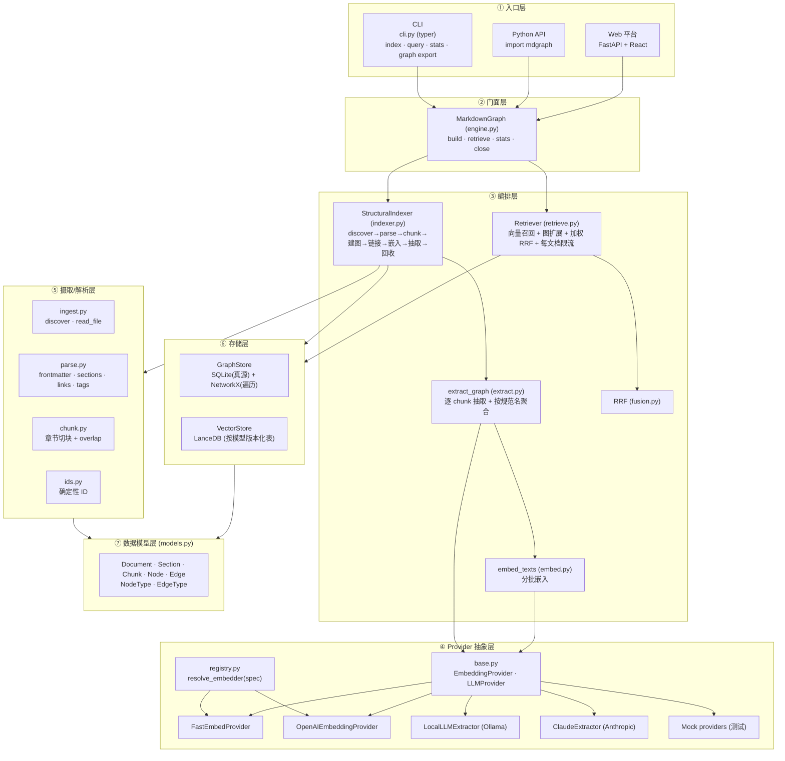
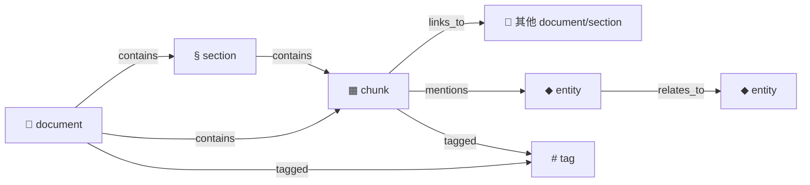
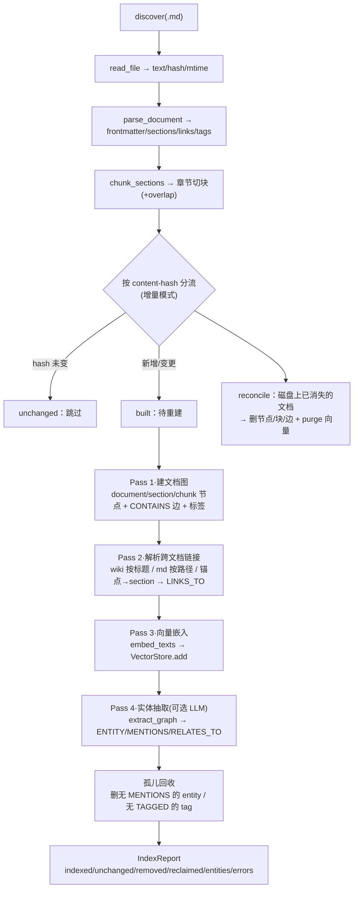
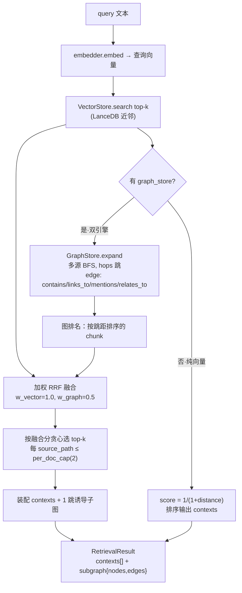
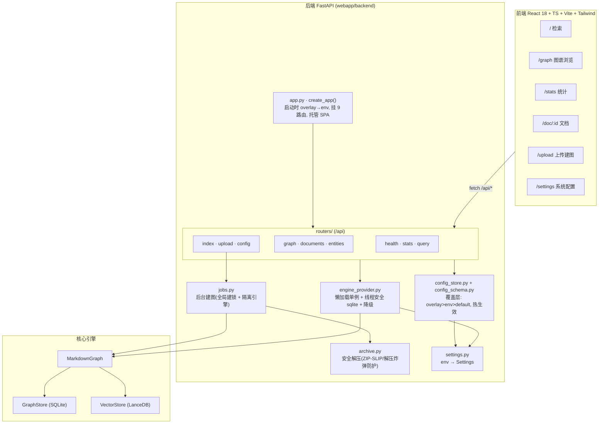
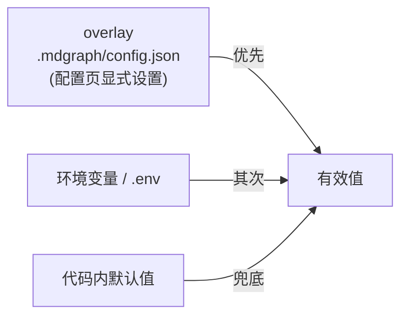

# markdown-graph (mdgraph)

> Markdown 知识图谱 + 向量双引擎检索 — 把一堆 `.md` 文档同时索引成**结构/语义图谱**与**向量库**，检索时让两路召回相互增强（vector recall × graph expand × 加权 RRF 融合）。

整条核心链路**纯离线、确定性、零外部凭证**（默认本地 fastembed 向量 + 本地 Ollama 实体抽取），可单测、可复现；同时提供命令行（CLI）与一套 FastAPI + React 的 Web 平台。

---

## 目录

- [核心特性](#核心特性)
- [系统整体架构](#系统整体架构)
- [知识图谱数据模型](#知识图谱数据模型)
- [索引构建流水线](#索引构建流水线)
- [检索流水线](#检索流水线)
- [模块分层详解](#模块分层详解)
- [Web 平台架构](#web-平台架构)
- [配置体系](#配置体系)
- [快速开始](#快速开始)
- [项目目录结构](#项目目录结构)
- [测试](#测试)

---

## 核心特性

| 能力 | 说明 |
| --- | --- |
| **结构图谱** | 解析 markdown 的标题层级、`[[wiki]]` / `[md](link)` 链接、`#tag`、frontmatter，建成 `document → section → chunk` 的包含树与跨文档链接。 |
| **语义图谱** | 可选接 LLM，从 chunk 抽取实体（concept/技术/产品/组织）与有向关系，建 `MENTIONS` / `RELATES_TO` 边。 |
| **向量检索** | LanceDB 嵌入式向量库，表名按 `embedder.name + dim` 版本化，换模型自动隔离。 |
| **双引擎融合** | 向量召回 + 图扩展（BFS）两路排名，加权 RRF 融合（图权重 < 向量权重，抑制 hub 过放大），每文档限流。 |
| **增量索引** | 按 content-hash 分流：未变跳过、变更重建、消失回收（含孤儿实体/标签回收）。 |
| **Provider 可插拔** | embedder / LLM 全经抽象接口 + 注册表解析，短名（`fastembed:` / `openai:`）或 dotted-path 动态加载，引擎不绑定任何具体实现。 |
| **三种入口** | Python 门面 `MarkdownGraph`、CLI `mdgraph`、Web 平台（上传建图 + 可视化检索 + 在线配置）。 |

---

## 系统整体架构

自底向上分七层，每层只依赖下层抽象。三个入口（CLI / Python / Web）都汇聚到同一个门面 `MarkdownGraph`。



---

## 知识图谱数据模型

图谱是一张**异构有向多重图**，SQLite 为真源、NetworkX 按需重建用于遍历。所有 ID 由 `ids.py` 确定性生成（`sha256` 前 16 位 hex），保证幂等与可复现。

**节点类型（`NodeType`）**

| 类型 | 来源 | 关键 meta |
| --- | --- | --- |
| `document` | 每个 `.md` 文件 | `path` |
| `section` | 标题层级切出的章节 | `heading_path`、`level` |
| `chunk` | 章节切块（检索最小单元） | `section_path`、`unresolved_links` |
| `entity` | LLM 抽取的实体 | `name`、`type`、`description`、`aliases` |
| `tag` | frontmatter / `#tag` | `name` |

**边类型（`EdgeType`）**

| 类型 | 含义 | 端点 |
| --- | --- | --- |
| `contains` | 结构包含 | document→section→chunk |
| `links_to` | 跨文档/锚点链接 | chunk → document/section |
| `tagged` | 打标签 | document/chunk → tag |
| `mentions` | chunk 提及实体 | chunk → entity |
| `relates_to` | 实体间有向关系（`meta.type` 存关系名） | entity → entity |



---

## 索引构建流水线

`StructuralIndexer.index()` 是整个写路径的核心，多趟（multi-pass）执行，全程可选 `progress(phase, current, total)` 回调上报进度（Web 上传建图用它做实时进度条）。



要点：

- **增量**：`content-hash` 命中即跳过；只有 `built`（新增/变更）文档才重建、嵌入、抽取。
- **一致性**：每文档的图写入在一个 SQLite 事务里（`commit=False` + 退出统一提交，异常回滚）；向量删除刻意放在事务外（向量是派生索引，下次构建会重新同步）。
- **抗脏**：单文档解析/构建异常被收进 `report.errors` 并跳过，不影响其它文档；errored 文档不参与嵌入/抽取。
- **防幽灵**：`relates_to` 仅在两端实体都出现在同一次抽取时保留；实体按 `entity_id`（规范化名）跨 chunk 聚合，合并 `aliases`。

---

## 检索流水线

`Retriever.retrieve()` 支持两种模式：纯向量（无 graph_store）与双引擎（默认）。双引擎用图扩展补召回、用加权 RRF 融合排序。



要点：

- **图扩展补召回**：向量 top-k 作种子，沿图扩 `hops` 跳，把语义/结构相邻但向量没命中的 chunk 拉进候选。
- **加权 RRF**：`score = Σ wᵢ × 1/(k + rank)`；图权重低于向量，抑制 hub 节点被图扩展过度放大。
- **每文档限流**：贪心选 top-k 时每个源文档最多 `per_doc_cap` 块，避免单文档刷屏。
- **可解释**：返回命中块的 1 跳诱导子图，前端可直接画图谱。

---

## 模块分层详解

### 核心引擎 `src/mdgraph/`

| 模块 | 职责 |
| --- | --- |
| `engine.py` | 门面 `MarkdownGraph`：组合 store + indexer + retriever，暴露 `build/retrieve/stats/close`。 |
| `indexer.py` | `StructuralIndexer`：写路径编排（见[索引流水线](#索引构建流水线)）。 |
| `retrieve.py` | `Retriever` + `Context` / `RetrievalResult`：读路径编排（见[检索流水线](#检索流水线)）。 |
| `models.py` | Pydantic 数据模型 + `NodeType` / `EdgeType` 枚举。 |
| `ingest.py` | `discover`（递归收 `.md`、去重排序）、`read_file`（text/hash/mtime）。 |
| `parse.py` | `parse_document`：frontmatter（YAML）、标题层级 sections、`[[wiki]]`/`[md]()` 链接、`#tag`；代码围栏感知（不误抽代码里的链接/标签）。 |
| `chunk.py` | `chunk_sections`：章节为块，超 `max_chars` 才按段落切 + `overlap`。 |
| `ids.py` | 确定性 ID：`doc_id`/`section_id`/`chunk_id`/`entity_id`（规范化名）/`tag_id`。 |
| `extract.py` | `extract_graph`：逐 chunk 调 LLM、按 `entity_id` 聚合、去重 mentions/relations、防幽灵关系。 |
| `embed.py` | `embed_texts`：按批上限分批调用 embedder。 |
| `fusion.py` | `reciprocal_rank_fusion`：可加权 RRF。 |
| `store/graph_store.py` | `GraphStore`：SQLite（documents/nodes/edges/chunks 四表）为真源，NetworkX `MultiDiGraph` 做 `neighbors`/`expand`/`subgraph` 遍历；事务上下文、`reclaim_orphans`、`export_graph`。 |
| `store/vector_store.py` | `VectorStore`：LanceDB，表名 `vectors_<sanitized name>_<dim>`，按模型+维度版本化。 |
| `cli.py` | typer CLI：`index` / `query` / `stats` / `graph export`。 |

### Provider 层 `src/mdgraph/providers/`

| 模块 | 职责 |
| --- | --- |
| `base.py` | 抽象接口 `EmbeddingProvider`（`name`/`dim`/`embed`）、`LLMProvider`（`extract`）+ 抽取结果 dataclass。 |
| `registry.py` | `resolve_embedder(spec)`：短名 `fastembed:`/`openai:` 走工厂，否则当 dotted-path 无参构造；失败抛带原文的 `ValueError`。 |
| `fastembed_embedder.py` | 本地 fastembed 向量（默认 `BAAI/bge-small-zh-v1.5`，无需 key）。 |
| `openai_embedder.py` | OpenAI 兼容嵌入端点（默认指向本地 Ollama，可改 cloud）。 |
| `local_llm_extractor.py` | 本地 LLM 实体抽取（openai SDK → 本地 OpenAI 兼容端点，默认 Ollama）；对畸形 JSON / 多种 relation 形态做防御解析。 |
| `anthropic_extractor.py` | Anthropic Claude，tool-use 强制结构化抽取。 |
| `mock.py` | 确定性 Mock embedder / LLM，供离线单测。 |

---

## Web 平台架构

`webapp/` 是核心引擎之上的一层应用：**FastAPI 后端**（9 个 `/api` 路由）+ **React/Vite SPA 前端**。后端通过一个**懒加载单例引擎**复用 `MarkdownGraph`，并在其之上加了线程安全、优雅降级、后台建图、配置热生效等服务能力。



### API 路由一览（前缀 `/api`）

| 方法 + 路径 | 作用 |
| --- | --- |
| `GET /health` | 健康检查 |
| `GET /stats` | 图/向量规模统计 |
| `POST /query` | 双引擎/纯向量检索（`mode`、`k`、`graph_weight`、`per_doc_cap`、`hops`） |
| `GET /graph` · `GET /graph/expand` | 全图（可截断）/ 子图扩展 |
| `GET /documents` · `GET /document/{id}` · `GET /node/{id}` | 文档列表 / 详情 / 节点邻居 |
| `GET /entities` | 实体列表（按提及数） |
| `POST /index` | 对服务器本地路径建索引 |
| `POST /upload` · `GET /jobs/{id}` | 上传压缩包异步建图（202）+ 轮询任务进度 |
| `GET /config` · `PUT /config` · `POST /config/reset` | 读取/更新/重置可视化系统配置 |

### 三个关键设计

- **单例引擎 + 优雅降级**（`engine_provider.py`）：图/存储读永远可用；若 embedder 依赖缺失或库内无向量，`query`/`index` 抛 `EngineUnavailable` → HTTP 503，其余接口照常。FastAPI 在线程池跑同步端点，故构造后把 SQLite 连接换成 `check_same_thread=False`，重配置用「换引用 + 延迟 GC」避免把连接从在飞读者脚下关掉。
- **后台建图**（`jobs.py` + `archive.py`）：上传走 202 + 任务轮询；全局 build 锁保证同时只跑一个构建（占用即 409）；用**独立引擎**（自带 sqlite 连接 + 新 provider）建图，成功后 `reset_engine()` 让服务单例重开到新数据；`archive.py` 防 ZIP-SLIP / 路径穿越 / 解压炸弹，只写 `.md`/`.markdown`。
- **配置热生效**（`config_schema.py` + `config_store.py`）：`config_schema.py` 是**所有可配置环境变量的单一事实源**（`FieldSpec`）；覆盖层 `overlay > env > default`，落盘到 `REPO_ROOT/.mdgraph/config.json`；保存时写进 `os.environ` 并 `reset_engine()`，下次 `get_settings()`/`get_engine()` 即读到新值。

---

## 配置体系

所有配置最终都体现为进程环境变量，三层优先级：



主要环境变量（完整清单见 `webapp/backend/config_schema.py`）：

| 变量 | 默认 | 说明 |
| --- | --- | --- |
| `MDGRAPH_STORE` | `./.mdgraph` | 图与向量存储目录（相对仓库根解析）。 |
| `MDGRAPH_EMBEDDER` | `mdgraph.providers.fastembed_embedder:FastEmbedProvider` | embedder spec：`fastembed:<model>` / `openai:<model>` / dotted-path。 |
| `MDGRAPH_LLM` | （空=不启用） | 实体抽取 provider 的 dotted-path。 |
| `MDGRAPH_EMBED_BASE_URL` / `_API_KEY` / `_MODEL` | 本地 Ollama | OpenAI 兼容嵌入端点配置（密钥不进 spec / 命令历史）。 |
| `MDGRAPH_LLM_BASE_URL` / `_API_KEY` / `_MODEL` | 本地 Ollama / `qwen2.5:3b` | 本地 LLM 抽取端点配置。 |
| `ANTHROPIC_API_KEY` / `_AUTH_TOKEN` / `_BASE_URL` / `_MODEL` | — | 用 Claude 做实体层时的凭证与端点。 |
| `MDGRAPH_MAX_ARCHIVE_BYTES` 等 | 见 schema | 上传/解压安全上限。 |

> ⚠️ **换 embedder 必须重建索引**：向量表名 `vectors_<name>_<dim>` 随模型+维度变化；换嵌入模型会指向**另一张表**，旧向量不再命中。**建库与查询的 embedder 必须一致**，换 `MDGRAPH_EMBEDDER` / `--embedder` 后须 `--full` 重建。

---

## 快速开始

### 安装

```bash
# 核心引擎
pip install -e .
# 本地 provider（fastembed 向量 + openai SDK 接本地 LLM）
pip install -e .[local]
# Web 平台后端
pip install -e .[web]
```

### CLI

```bash
# 建索引（结构图 + 向量；加 --llm 才抽实体）
python -m mdgraph.cli index examples/ai_kb \
  --store ./.mdgraph \
  --embedder fastembed:BAAI/bge-small-zh-v1.5

# 检索（embedder 须与建库时一致）
python -m mdgraph.cli query "向量数据库怎么选" \
  --store ./.mdgraph --embedder fastembed:BAAI/bge-small-zh-v1.5 -k 8

# 统计 / 导出图谱
python -m mdgraph.cli stats --store ./.mdgraph
python -m mdgraph.cli graph export --store ./.mdgraph -o graph.json
```

### Python API

```python
from mdgraph import MarkdownGraph
from mdgraph.providers.fastembed_embedder import FastEmbedProvider

mg = MarkdownGraph("./.mdgraph", embedder=FastEmbedProvider())
report = mg.build(["examples/ai_kb"])      # 增量构建
result = mg.retrieve("RAG 是什么", k=8)     # 双引擎检索
for c in result.contexts:
    print(c.score, c.source_path, c.heading_path)
mg.close()
```

### 端到端 Demo

`examples/run_demo.py` 在中文 AI 知识库上建图，并量化对比纯向量 vs 双引擎检索（默认本地 Ollama，零外部 key）：

```bash
ollama serve & ollama pull qwen2.5:3b   # 本地 LLM（仅首次拉模型）
PYTHONPATH=src python examples/run_demo.py
```

详见 [`examples/README.md`](examples/README.md)。

### Web 平台

```bash
# 后端（仓库根）
MDGRAPH_STORE=./.mdgraph uvicorn webapp.backend.app:app --reload --port 8000
# 前端
cd webapp/frontend && npm install && npm run dev   # http://localhost:5173
```

详见 [`webapp/README.md`](webapp/README.md)。

---

## 项目目录结构

```
markdown-graph/
├── src/mdgraph/                  # 核心引擎（provider 无关）
│   ├── engine.py                 #   门面 MarkdownGraph
│   ├── indexer.py                #   写路径编排 StructuralIndexer
│   ├── retrieve.py  fusion.py    #   读路径编排 Retriever + RRF
│   ├── parse.py  chunk.py  ingest.py  ids.py
│   ├── extract.py  embed.py  models.py
│   ├── store/                    #   GraphStore(SQLite) · VectorStore(LanceDB)
│   └── providers/                #   embedder/LLM 抽象 + registry + 各实现
├── webapp/
│   ├── backend/                  # FastAPI：app · routers · engine_provider · jobs · archive · config_*
│   └── frontend/                 # React + Vite + Tailwind SPA（6 个页面）
├── examples/                     # run_demo.py + ai_kb/ 中文知识库
├── docs/                         # 设计 / 切片计划
└── tests/                        # 引擎单测（webapp 测试在 webapp/backend/tests）
```

---

## 测试

```bash
# 核心引擎
python -m pytest tests
# Web 后端（离线 Mock provider，无网络、无真实模型）
python -m pytest webapp/backend/tests
# 前端
cd webapp/frontend && npm test
```

引擎层与 Web 测试均使用确定性 Mock providers（`DeterministicEmbeddingProvider` / `MockLLMProvider`），保证离线可复现。
